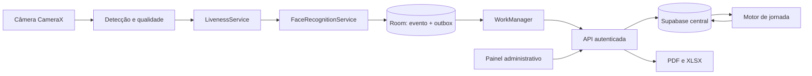

# Arquitetura — fase 01

## Decisões

| Problema | Opções consideradas | Escolha e motivo |
| --- | --- | --- |
| Câmera, kiosk e persistência Android | Kotlin nativo; Flutter | Kotlin + Jetpack Compose + CameraX: acesso direto ao ciclo de câmera e às APIs do dispositivo. Não usar WebView como terminal. |
| Gravar sem internet | Memória; arquivos; banco local | Room/SQLite com marcação e outbox na mesma transação. WorkManager envia pendências após reconexão e após reiniciar o aplicativo. |
| Backend próprio | Python; Node.js | Node.js 24 + TypeScript + Fastify, com módulos de domínio separados do transporte. Monólito modular para reduzir operação no MVP. |
| Painel | SSR; SPA | React + TypeScript + Vite; painel autenticado não requer SEO. Acesso de negócio pela API. |
| Base e login | PostgreSQL próprio; Supabase | Supabase Auth + PostgreSQL, migrations SQL versionadas e RLS. Uma base, com isolamento por empresa e vários locais. |
| Reconhecimento local sem cobrança | APIs pagas; modelos locais | OpenCV Android, candidato YuNet + SFace, encapsulado por FaceRecognitionService. Homologação de licença do artefato e desempenho na fase 06. |
| Liveness | Modelo passivo RGB; desafio ativo; câmera de profundidade | `PresentationAttackDetectionProvider` independente e protocolo temporal com desafio aleatório. O build de desenvolvimento usa o desafio ativo como barreira de teste; produção permanece bloqueada até PAD passivo homologado. |
| Relatórios | Serviço externo; geração própria | XLSX próprio com `fflate` e PDFKit, ambos consumindo a mesma consulta filtrada do painel. |

Versões exatas de bibliotecas de implementação serão travadas nos lockfiles em sua fase, após compilação. As dependências atuais servem apenas aos contratos.

## Fluxo

O tablet recebe catálogo autorizado de funcionários e perfis faciais versionados. Escalas podem aparecer no catálogo para consulta, mas não determinam o tipo local da batida. O evento original é imutável; a classificação é uma projeção do backend. Online, a confirmação pode mostrar o tipo devolvido pelo servidor; offline: “Ponto registrado às 08:02. Será sincronizado automaticamente.” Não inventar “Entrada” sem classificação central.

## Limites e invariantes

1. `company_id` delimita a empresa, não o local. Funcionário pode atuar em vários locais explicitamente autorizados.
2. UUID é criado uma única vez ao persistir o evento no tablet; retries reutilizam o ID e conteúdo. A entrega pode se repetir; o efeito no servidor não.
3. Payload enviado pelo terminal não define empresa, local, tipo, status de sincronização ou horário do servidor. Esses valores são derivados do vínculo autenticado e do processamento central.
4. Não apagar ou sobrescrever marcações. Correção é outro registro com motivo, valores anterior/novo, autor e horário do servidor.
5. Escalas, regras e vínculos têm versão e vigência. Reprocessar grava uma revisão, mantendo o cálculo anterior e sua auditoria.
6. Minutos inteiros para durações e saldos; instantes UTC em `timestamptz`; datas de jornada no fuso IANA da empresa (inicial: America/Fortaleza).
7. Uma jornada pode atravessar meia-noite. Identidade: empresa + funcionário + início da instância de escala, não simplesmente data civil da batida.
8. Batida ausente ou ambígua gera ocorrência e saldo provisório. Nenhuma saída é fabricada.
9. Horas extras brutas, atrasos, déficit e saldo líquido são métricas distintas. Saldo positivo = trabalhado menos previsto, coerente com os exemplos do requisito 24, cuja fórmula textual está invertida.
10. Duas batidas próximas em terminais diferentes são preservadas e sinalizadas; não são eliminadas como retry, pois seus IDs são diferentes.

## Autenticação e autorização

Gestores usam Supabase Auth. API valida assinatura, emissor, audiência, expiração e vínculo ativo em `company_memberships`; não confiar em cargo vindo do cliente ou de metadados editáveis pelo usuário. Seleção de empresa é validada contra os vínculos. Operações de negócio propagam o JWT do usuário ao Supabase para manter RLS.

Terminais possuem identidade Auth própria vinculada a uma única linha ativa em `terminals`, sem conta compartilhada. Pareamento: administrador emite código aleatório de uso único, armazenado como hash, com expiração; API troca esse código por credencial individual por canal TLS. Rotação/revogação e vínculo são auditados. Secret/service-role é permitido exclusivamente no processo administrativo de provisionamento, nunca no APK ou painel. Rotas ordinárias não usam essa chave.

O perfil Terminal só acessa seu catálogo autorizado e RPCs de sincronização, heartbeat, ocorrências e cadastro delegado. Não recebe SELECT irrestrito sobre funcionários, embeddings ou pontos. Toda RPC privilegiada verifica `auth.uid()`, terminal ativo e empresa, fixa `search_path` e não aceita empresa arbitrária. Funções auxiliares de autorização usam esquema privado, sem recursão nas políticas de membership.

| Perfil | Permissões previstas |
| --- | --- |
| Administrador | Empresa, vínculos, locais, terminais, regras e todas as operações de RH |
| Gestor | Funcionários, escalas e relatórios dos locais atribuídos; solicitar correções |
| RH | Funcionários, escalas, revisão de ocorrências e correções justificadas, relatórios da empresa |
| Operador | Consultar status de terminais e executar cadastros faciais delegados; sem corrigir ponto ou exportar dados gerais |
| Terminal | Seu catálogo e suas operações de captura/sincronização; sem funções administrativas |

RLS também cobre Storage se utilizado. Perfis biométricos são cifrados; chaves no servidor e Android Keystore, nunca no código. Fotos brutas descartadas após processamento por padrão. Logs excluem tokens, CPF, fotos e vetores. Retenção e exclusão de perfis são configuradas por empresa e auditadas; marcações históricas não dependem da permanência do perfil facial.

## Offline, horário e consistência

Ao confirmar uma pessoa viva, gravar evento + outbox em uma transação Room; só então confirmar visualmente. Falha de armazenamento não pode mostrar sucesso. Reinício recupera a outbox. WorkManager usa restrição de rede, lotes limitados e backoff com jitter. Apenas confirmação individual da API permite marcar como sincronizado.

Guardar relógio civil do dispositivo, `elapsedRealtime`, identificador de boot e âncora de horário obtida do servidor na sessão. A âncora vincula nonce, terminal, horário e limite de incerteza de RTT; servidor guarda essa associação. Estimar UTC por diferença monotônica apenas no mesmo boot. Mudança de relógio civil é comparada com essa estimativa. Reinício invalida a continuidade monotônica: continuar capturando, mas sinalizar horário não verificado até nova âncora. Não há garantia de relógio inviolável em dispositivo comprometido.

`server_timestamp` é recebimento, nunca substituição automática do instante da batida. Dias de atraso no envio não significam fraude de relógio. Instantes suspeitos ficam preservados e sujeitos a revisão. Terminal revogado offline não conhece a revogação imediatamente: API rejeita/quarentena o lote ao retornar; aplicativo preserva os registros sem confirmá-los como aceitos.

Sincronização em ordem diferente nos dois terminais recalcula as jornadas afetadas sob transação/lock por funcionário e período. Catálogo usa cursor, versões e tombstones; funcionário desativado deixa de ser elegível ao atualizar o cache. Terminal sem catálogo prévio exige configuração online antes de operar.

## Operação e crescimento

API stateless atrás de HTTPS; migrations aplicadas em etapa explícita; segredos em variáveis do ambiente de execução. Banco central com backup e ensaio de restauração. Não iniciar com Redis ou microserviços. Jobs persistentes de cálculo/exportação podem usar tabela PostgreSQL com lease e retry. Monitoramento distingue último heartbeat, última sincronização aceita e tamanho da fila informado; ausência de heartbeat indica “sem comunicação”, não prova de desligamento.

Kiosk real exige provisionamento de dispositivo dedicado e allowlist de lock task. Acesso de manutenção autenticado e auditado. Desabilitar backups Android de dados biométricos e fila, impedir duplicação de identidade por restauração e evitar manter a câmera ativa no background.

## Fontes técnicas verificadas em 13/09/2026

- [Android: arquitetura offline, Room e WorkManager](https://developer.android.com/topic/architecture/data-layer/offline-first)
- [Android: lock task em dispositivos dedicados](https://developer.android.com/work/dpc/dedicated-devices/lock-task-mode)
- [Android: SystemClock e relógio monotônico](https://developer.android.com/reference/android/os/SystemClock)
- [Supabase: RLS e riscos de service role](https://supabase.com/docs/guides/database/postgres/row-level-security)
- Licenças de modelos e critérios de homologação em [reconhecimento](face-recognition.md).
